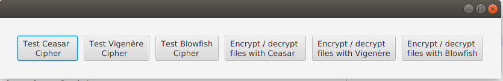
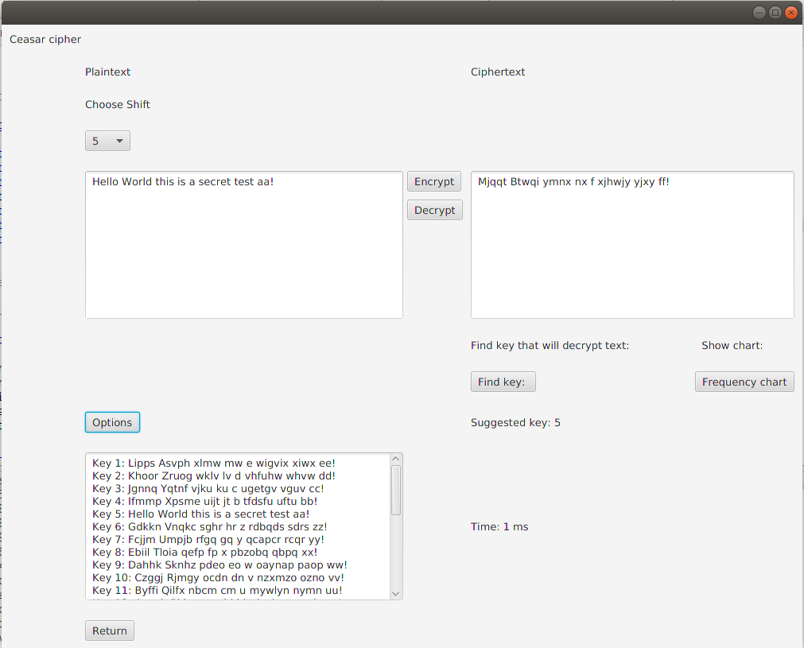
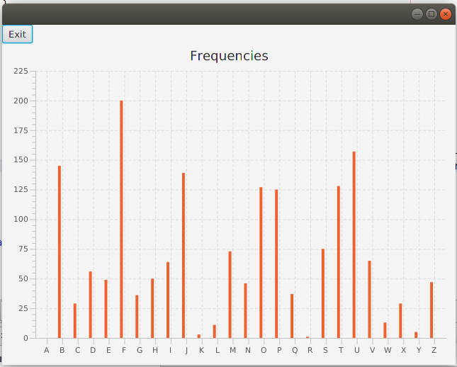
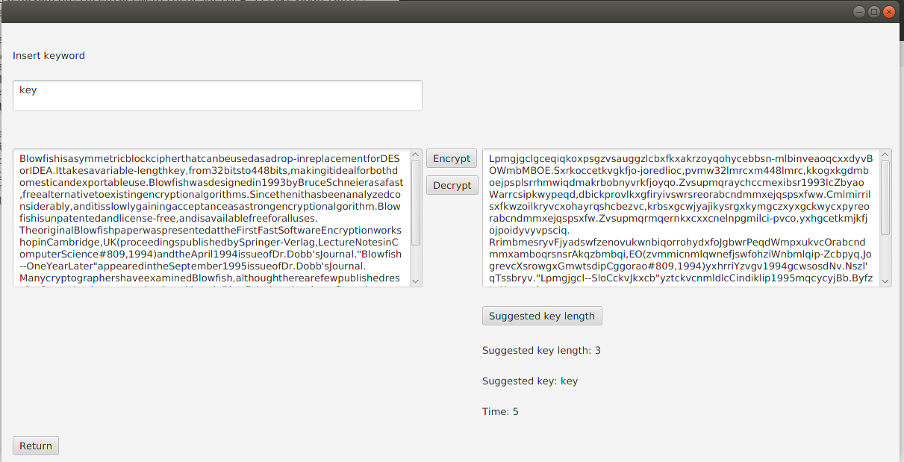
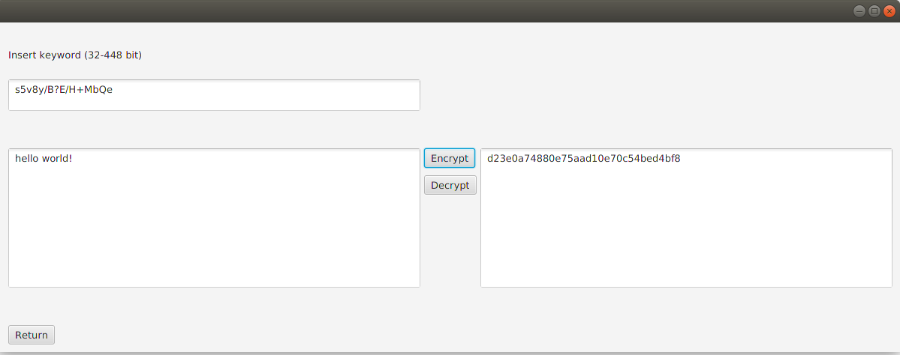
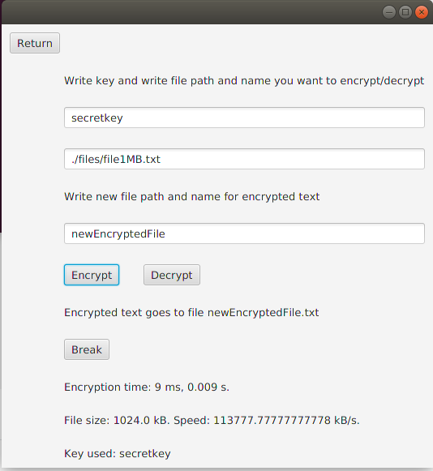

## Käyttöohje

Lataa tiedosto [Encryption.jar](https://github.com/millalin/EncryptionAndCryptanalysis/releases/tag/v1.0)

### Ohjelman käynnistäminen

Ohjelma käynnistetään komennolla

    java -jar Encryption.jar

### Alkunäkymä

Alkunäkymässä voi valita, minkä salauksen haluaa toteuttaa ja haluaako kirjoittaa tekstiä vai salata valmiin tekstitiedoston. Salaukset toimivat englannin kielellä. Joka salaukseen tulee valita salausavain, ainoastaan Caesar salauksessa valikossa oletusavaimena on 1. Salausavainten sanoissa ei tule käyttää välilyöntiä. Vigenere salauksessa tulee käyttää englannin kielen aakkosia, Blowfish salausavaimessa voi käyttää myös erikoismerkkejä.

### Komentorivikomennot

Testit voidaan suorittaa komennolla

    mvn test

Testikattavuusraportti luodaan komennolla

    mvn jacoco:report

Kattavuusraportti on tarkasteltavissa selaimella avaamalla tiedosto sijainnista target/site/jacoco/index.html

### Salaukset

Caesar salauksessa tulee valita salausavain (numero) valikosta väliltä 1-26. Tämän jälkeen haluttu teksti voidaan salata tai purkaa. Options napista saa salatusta tekstistä näkyviin kaikki mahdolliset vaihtoehdot eri salausavaimilla. Frekvenssinapista on nähtävissä salatun tekstin aakkosten jakauma. Break napista saa näkyviin ohjelman laskeman arvauksen salatussa tekstissä käytetystä salausavaimesta.

Caesarilla salatun tekstin kirjainjakaumaa voi tarkastella kohdasta Frequency Chart. Tyypillisessä englanninkielisessä tekstissä yleisin kirjain on E ja toiseksi yleisin kirjain on T. Tästä ohjelma voi päätellä, mikä siirto tarvitaan eli mikä avain on kyseessä.

Vigenere salauksessa ylälaatikkoon tulee kirjoittaa salauksessa tai sen avaamisessa käytettävä salausavain. Avaimessa tulee käyttää kirjaimia a-z tai A-Z ja välilyöntiä ei tule käyttää. Salattu testi voidaan tämän jälkeen salata tai yrittää purkaa. Salatusta tekstistä voidaan etsiä todennäköisintä salausavaimen pituutta ja ehdotettua salausavainta. 

Blowfish salaus toimii Ascii merkistöllä, se ei avaa salauksesta kaikkia muita erikoismerkkejä oikein. Salausavaimessa voi käyttää salatessa myös esimerkiksi merkkejä !/%&?. Yläkenttään kirjoitetaan käytettävä salausavain (32-448 bittiä) ja tekstikenttään salattava teksti. Teksti voidaan salata Encrypt napista. Valmiiksi salattu teksti voidaan purkaa kirjoittamalla oikea salausavain ja lisäämällä teksti oikeanpuoleiseen tekstikenttään. Decrypt napista avattu teksti ilmestyy vasenmpaan kenttään.

 
Ohjelmassa voidaan myös salata tekstitiedostoja. Tiedostonäkymiin pitää myös syöttää salausavain. Tämän jälkeen tulee kirjoittaa avattavan tiedoston polku ja koko nimi. Alimpaan tekstikenttään tulee syöttää uuden tiedoston polku sekä nimi (ilman tiedostopäätettä) ja painaa Encrypt nappia. Tekstin purkamisessa tulee syöttää samat tiedot, jolloin salatusta tekstitiedostosta luodaan avattu tiedosto painamalla Decrypt nappia.  

