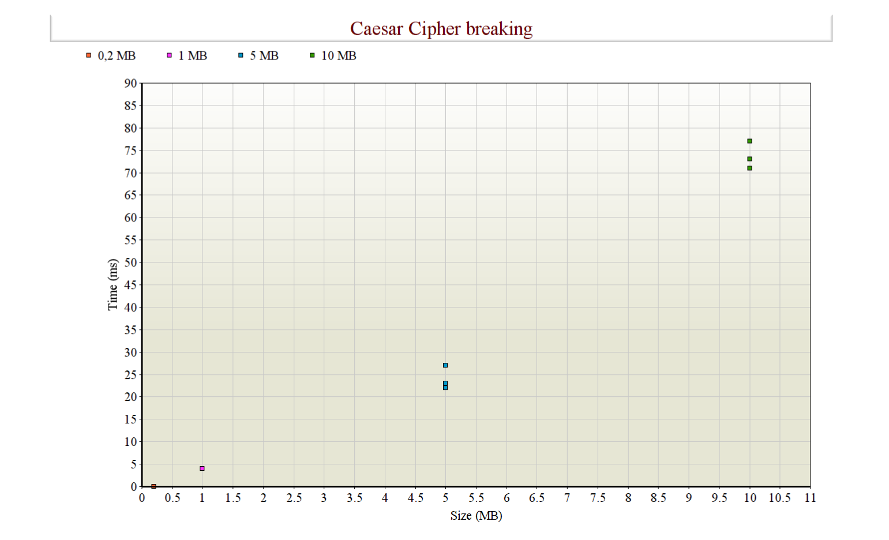
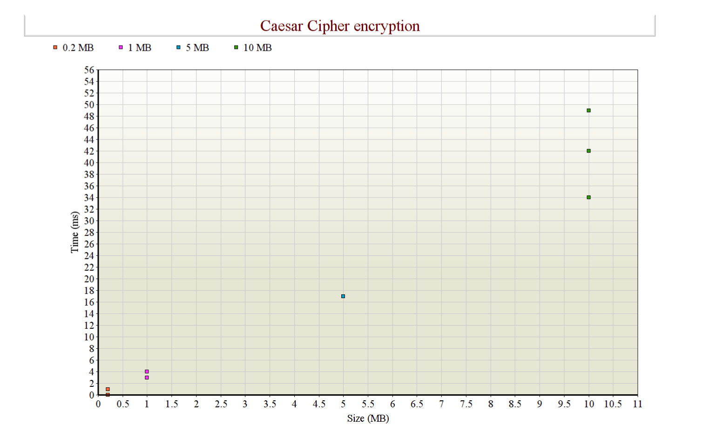

# Testausdokumentti

### Yksikkötestaus

Testeissä on testattu, että salaukset toimivat oikein ja myös purkavat salauksen oikein takaisin. Testit on tehty käyttäen JUnitia. Testien oikeat salaustulokset on tarkistettu myös osin käsin sekä valmiilla salausohjelmilla. 

Testit voidaan suorittaa komennolla

    mvn test

Jacoco voidaan suorittaa komennolla

    mvn jacoco:report

Raportti löytyy target/site/jacoco/index.html

### Suorituskykytestaus

Suorituskykytesteissä testataan Blowfish salauksen nopeutta salatessa ja salausta purkaessa eri kokoisilla tekstitiedostoilla. Vigenere ja Caesar salauksissa nopeutta testataan tapauksissa, joissa salaus yritetään murtaa tietämättä avainta. 

Blowfish salauksessa tutkitaan salaukseen sekä sen purkamiseen menevää aikaa erikokoisilla tekstitiedostoilla. 

Käytetty Java versio oli 1.8.0_211 ja käyttöjärjestelmä Ubuntu 18.04. 

### Miten testit voidaan toistaa?

Ohjelman alkunäkymässä on 3 eri nappia (file Caesar, file Vigenere ja file Blowfish), joista pääsee omiin näkymiinsä. Näihin voidaan syöttää salattava tai murrettava tekstitiedosto ja ohjelma laskee salaukseen tai murtamiseen kuluvan ajan. Ikkunassa näkyy tiedoston koko ja nopeus. 

### Testauksen tuloksia ja suorituskyky

Salauksien nopeuksia sekä murtoyrityksien nopeuksia tutkitaan Javan System.currenttimeMillis() -metodin avulla. 

#### Caesar Cipher

Toteutettua Caesar salausta testattiin erikokoisilla tekstitiedostoilla, joissa teksti oli kerätty yleisestä englanninkielen artikkelista tiedostoon ja muodostettu näin erikokoisia tekstitiedostoja.

Caesar Cipher testattiin tekstitiedostoilla, joiden koko oli 0.2 MB, 1 MB, 5 MB sekä 10 MB. Toistoja tehtiin useita, ja mitä pienempi tiedosto oli, sitä useammin salaus ja murto tapahtui samassa ajassa. Pienempiä tiedostoja testattiin myös, mutta koska aika oli niin nopea, ei niiden tulosten lisääminen kaavioon ole mielekästä. Kaaviosta nähdään, että salaus tapahtuu lineaarisessa ajassa. 

Ohjelmassa testattiin myös Caesar Cipher murron nopeutta tietämättä salausavaimen numeroa. Murto tapahtui lineaarisessa ajassa, kuten odotettua, sillä ohjelma käy tekstin kerran läpi ja laskee kuinka useasti kukin kirjain esiintyy. Tämän jälkeen aakkostaulukko, käydään kerran läpi, joka tapahtuu vakioajassa.  Murto oli hieman hitaampaa kuin salaus, mutta myös niin nopea, ettei pienillä tiedostoilla ollut mielekästä sitä testata enempää. 10 MB tekstitiedoston onnistui murtaa keskimäärin 75 millisekunnissa eli 0.075 sekunnissa.   

   
