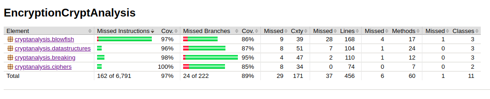
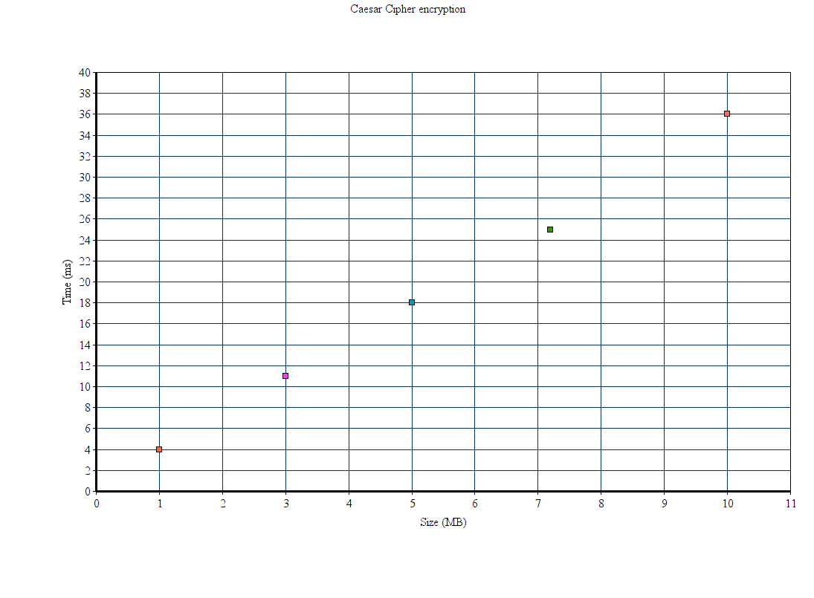
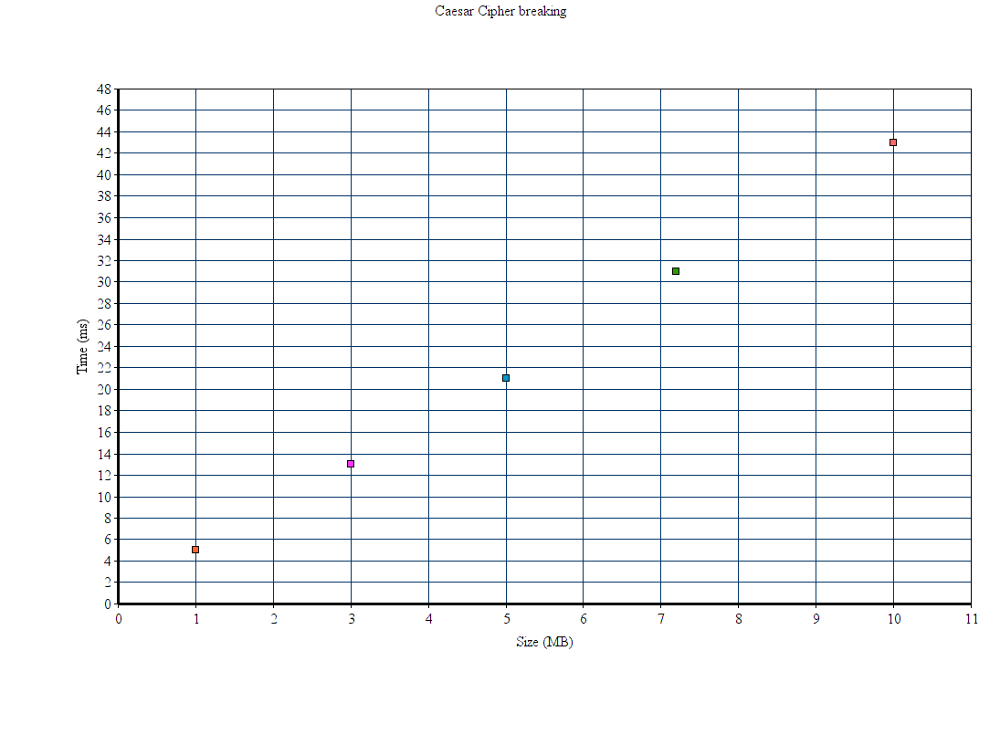
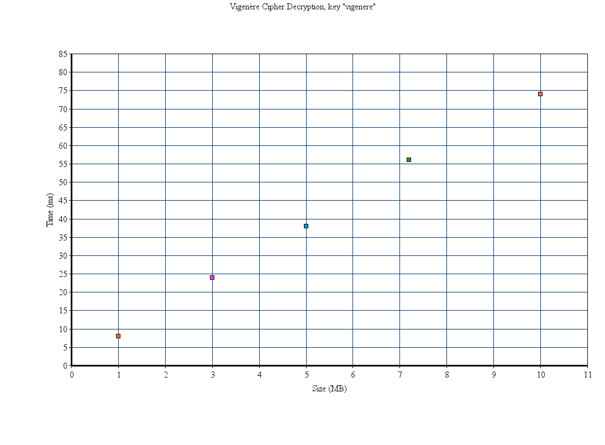
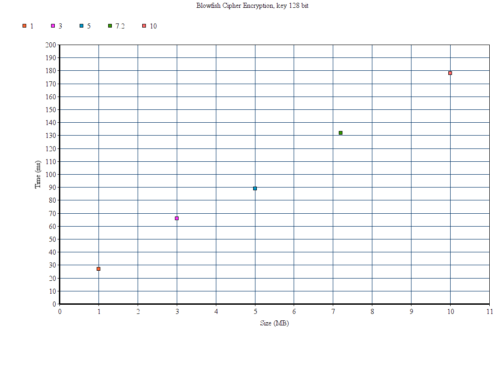
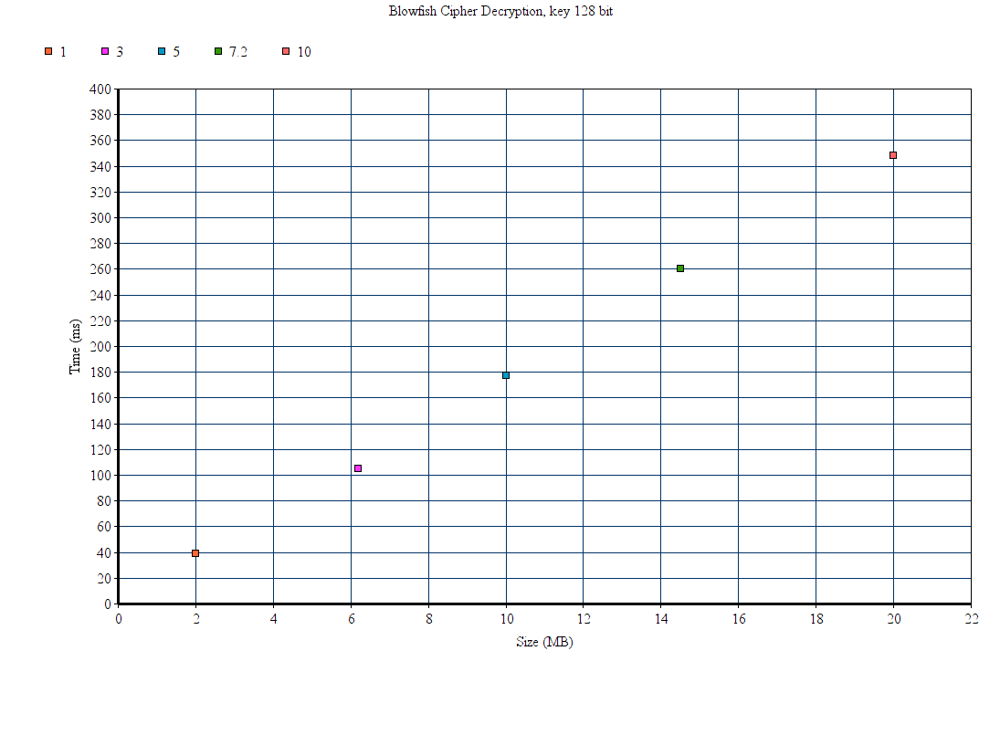

# Testausdokumentti

### Yksikkötestaus

Testeissä on testattu, että salaukset toimivat oikein ja myös purkavat salauksen oikein takaisin. Testeissä on myös testattu omien tietorakenteiden oikein toimivuutta. Testit on tehty käyttäen JUnitia. Testien oikeat salaustulokset on tarkistettu myös osin käsin sekä valmiilla salausohjelmilla. 

Testit voidaan suorittaa komennolla

    mvn test

Jacoco voidaan suorittaa komennolla

    mvn jacoco:report

Raportti löytyy target/site/jacoco/index.html

Testien rivikattavuus on 97 % ja haaraumakattavuus 89 %. Kattavuusraportista on jätetty käyttöliittymä ulkopuolelle.

### Suorituskykytestaus

Suorituskykytesteissä testataan Blowfish salauksen nopeutta salatessa ja salausta purkaessa eri kokoisilla tekstitiedostoilla. Vigenere ja Caesar salauksissa nopeutta testataan tapauksissa, joissa salaus yritetään murtaa tietämättä avainta. 

Blowfish salauksessa tutkitaan salaukseen sekä sen purkamiseen menevää aikaa erikokoisilla tekstitiedostoilla. 

Käytetty Java versio oli 1.8.0_211 ja käyttöjärjestelmä Ubuntu 18.04. 

### Miten testit voidaan toistaa?

Ohjelman alkunäkymässä on 3 eri nappia (file Caesar, file Vigenere ja file Blowfish), joista pääsee omiin näkymiinsä. Näihin voidaan syöttää salattava tai murrettava tekstitiedosto ja ohjelma laskee salaukseen tai murtamiseen kuluvan ajan. Ikkunassa näkyy tiedoston koko ja nopeus. 

Luokassa TimeTesting.java voidaan suorittaa testauksia tehdyn Blowfish toteutuksen ja Javan valmiin Blowfish toteutuksen välillä. Käyttöliittymäluokasta poistamalla kommentit, saadaan laskettua eroja näiden välillä.
 
## Testauksen tuloksia ja suorituskyky

Salauksien nopeuksia sekä murtoyrityksien nopeuksia tutkitaan Javan System.currenttimeMillis() -metodin avulla. 

### Caesar Cipher

Toteutettua Caesar salausta testattiin erikokoisilla tekstitiedostoilla, joissa teksti oli kerätty yleisestä englanninkielen artikkelista tiedostoon ja muodostettu näin erikokoisia tekstitiedostoja.

Caesar Cipher testattiin tekstitiedostoilla, joiden koko oli 1 MB, 3 MB, 5 MB, 7.2 MB sekä 10 MB. Toistoja tehtiin useita, ja mitä pienempi tiedosto oli, sitä useammin salaus ja murto tapahtui täysin samassa ajassa. Pienempiä tiedostoja testattiin myös, mutta koska aika oli niin nopea, ei niiden tulosten lisääminen kaavioon ole mielekästä. Kaaviosta nähdään, että salaus tapahtuu lineaarisessa ajassa ja siinä on merkitty mittausten keskiarvot kullekin tiedostokoolle. 

Ohjelmassa testattiin myös Caesar Cipher murron nopeutta tietämättä salausavaimen numeroa. Murto tapahtui lineaarisessa ajassa, kuten odotettua, sillä ohjelma käy tekstin kerran läpi ja laskee kuinka useasti kukin kirjain esiintyy. Tämän jälkeen aakkostaulukko, käydään kerran läpi, joka tapahtuu vakioajassa.  Murto oli hieman hitaampaa kuin salaus (tosin vain muutamia millisekunteja), mutta myös niin nopea, ettei pienillä tiedostoilla ollut mielekästä sitä testata enempää. 10 MB tekstitiedoston onnistui murtaa keskimäärin 43 millisekunnissa eli 0.043 sekunnissa.   

   
### Vigenère Cipher

Vigenère Cipher salaus testattiin tekstitiedostoilla, kooltaan 1, 3, 5, 7.2 ja 10 MB.

Kaaviossa on kunkin tiedostokoon keskirvo mittauksista. Salaus toteutettiin salausavaimilla "blowfish" sekä "key" eli avainpituuksilla 8 ja 3. Avaimen pituudella ei todettu olevan vaikutusta salausaikoihin testatuilla tiedostokoilla. Salaus toimii lineaarisessa ajassa ja aika mitattiin itse salauksesta. Aikaan ei mitattu esimerkiksi salatun tekstin tiedostoon kirjoittamista.  

 

Vigenère Cipher salauksen purku testattiin salatuilla tekstitiedostoilla, joiden koot olivat samat kuin alkuperäiset tekstitiedostot. Salauksen purku tapahtuu myös lineaarisessa ajassa ja kesto oli samaa luokkaa salauksen kanssa.  

Vigenèrellä salatun tekstin murtamiseen kulunutta aikaa mitattiin tidostoilla, joiden koot olivat 200 kB, 400 kB, 600 kB, 800 kB ja 1 MB. Tässä mittauksessa ei ollut merkitystä, löytääkö murtoyritys oikean avaimenpituuden ja oikean avaimen, kunhan löytyi ehdotus avaimen pituudeksi sekä avaimeksi. Avaimen pituus oli 3 näissä tiedostoissa. Kun syötteen koko noin kaksinkertaistuu, salaukseen kulunut aika suurin piirtein nelinkertaistuu. Salauksen purussa käydään koko syöte samalla muodostaen 3 merkin yhdistelmiä. Nämä yhdistelmät käydään vielä läpi ja niistä etsitään samojen yhdistelmien erot ja lopulta lasketaan, mitä tekijää on eniten. Tämä on todennäköisin avaimen pituus. Avaimen arvauksessa syöte käydään vielä uudelleen kertaalleen läpi.  

 

Vigenèressä salausta yritetään murtaa etsimällä tekstistä toistuvuuksia ja laskemalla niiden tekijät löytäen todennäköisin avaimenpituus ja sen jälkeen frekvenssianalyysin avulla jokaisella avaimen kirjaimelle omassa tekstikohdassaan etsitään todennäköisin kirjain. Murtoa testattiin erilaisilla tekstitiedostoilla ja parhaiten murrossa toimii välilyönnitön ja välimerkitön teksti, jolloin kirjainten toistuvuuksia saadaan mahdollisimman paljon. Murtaminen on myös sitä todennäköisempää, mitä pidempi ja monipuolisempi teksti on ja silloin, kun se on normaalia englanninkielen tekstiä, joka noudattaa kielessä esiintyvien kirjainten todennäköisyyksiä mahdollisimman hyvin. 

Alla on taulukoitu tekstitiedostojen vigenere.txt ja vigenere2.txt tuloksia. Tekstitiedostot on ensin salattu Vigenere Cipher salauksella, jonka jälkeen salatusta tekstistä on yritetty saada tietoon salauksessa käytetty avain.  Murto onnistui avaimen pituuksilla 3 ja 4. Avaimen pituudella 5 toisesta tekstistä löytyi oikea vastine, toisesta tekstistä löytyi oikea avaimenpituus, lasketusta avainsanasta oli väärin yksi kirjain. Avainten pituudella 6 ja 8 molemmista teksteistä tuli avaimen pituuden ehdotukseksi puolet sen oikeasta pituudesta. Teksteistä siis löytyi enemmän toistoa pidemmillä avaimilla salattuna silti lyhyemmistä pätkistä. Avainpituus 7 sen sijaan onnistui antamaan oikean pituustuloksen ja molemmissa teksteissä avainsana jäi vain 1 kirjaimen päähän. 10 merkin mittaisessa salausavaimessa toisesta tekstistä löydettiin oikea pituus ja toisesta puolet siitä. 

Salausavaimet tekstitiedostossa vigenere.txt:

Käytetty avainpituus | Käytetty avain | Löydetty avainpituus |  Löydetty avain | 
---------------------|----------------|----------------------|-----------------|
 3                   | key            | 3                    | key             | 
 4                   | fish           | 4                    | fish            | 
 5                   | world          | 5                    | wogld           |
 6                   | orange         | 3                    | nga             | 
 7                   | blowfis        | 7                    | blowfes         | 
 8                   | blowfish       | 4                    | blow            | 
 10                  | littleyour     | 10                   | leitleyyur      | 

Salausavaimet tekstitiedostossa vigenere2.txt:

Käytetty avainpituus | Käytetty avain | Löydetty avainpituus |  Löydetty avain |               
---------------------|----------------|----------------------|-----------------|                
 3                   | key            | 3                    | key             |      
 4                   | fish           | 4                    | fish            |      
 5                   | world          | 5                    | world           |    
 6                   | orange         | 3                    | bga             | 
 7                   | blowfis        | 7                    | flowfis         |
 8                   | blowfish       | 4                    | fisw            |
 10                  | littleyour     | 5                    | oixua           |

### Blowfish 

Blowfish salattiin ja avattiin tekstitiedostoilla, joiden koot olivat 1 MB, 3 MB, 5 MB, 7,2 MB sekä 10 MB. Salaukset toteutettiin 64-, 128- ja 448-bittisillä avaimilla. Jokaisen tiedostokoon salauksen/purun ajasta laskettiin keskiarvot, jotka on nähtävillä allaolevissa kaavioissa. Saman tiedostokoon salaus- ja purkuaika eri bittikoon avaimilla oli hyvin lähellä toisiaan, vaihtelua keskiarvoissa oli vain muutamia millisekunteja. Salausaikoihin ei ole laskettu tiedostosta lukemista, eikä tiedostoon kirjoittamista. Aika on mitattu vain itse salauksesta ja sekä salaus että salauksen purku toteutui lineaarisessa ajassa.

Salaus 64 bittisellä avaimella:

Salauksen purku 64 bittisellä avaimella:

 

Salaus 128 bittisellä ja 448 bittisellä avaimella:

Salauksen purku 128 bittisellä avaimella:

#### Oman Blowfish toteutuksen ja Javan valmiin Blowfish salauksen vertailu

Oma toteutus vaikuttaa salaavan Javan valmista versiota nopeammin. Javan valmiissa versiossa salauksen alustukseen kuluu aikaa aina noin 150-200 millisekuntia silloin kun siihen haluaa asettaa oman salausavaimen ja omalla toteutuksella alustukseen kuluu noin 30-70 millisekuntia. Myös Javan toteutuksen salaus vaikuttaisi olevan hitaampi testatuilla tekstitiedostoilla. Allaolevassa taulukossa on vertailu mitatuista ajoista (keskiarvo mittauksista). Javan valmiin toteutuksen tutkimiseen ja sen toimintatapaan ei tutustuttu tässä sen tarkemmin. 
 

Tiedostokoko | Java kokonaisaika | Java vain salaus |  Oma kokonaisaika | Oma vain salaus
-------------|-------------------|------------------|-------------------|----------------
 1 MB        | 278 ms	         | 82 ms            | 88 ms             | 22 ms
 3 MB        | 284 ms            | 130 ms           | 92 ms             | 65 ms
 5 MB        | 358 ms            | 190 ms           | 126 ms            | 89 ms
 7.2 MB      | 452 ms            | 276 ms           | 181 ms            | 128 ms
 10 MB       | 511 ms            | 367 ms           | 239 ms            | 170 ms

