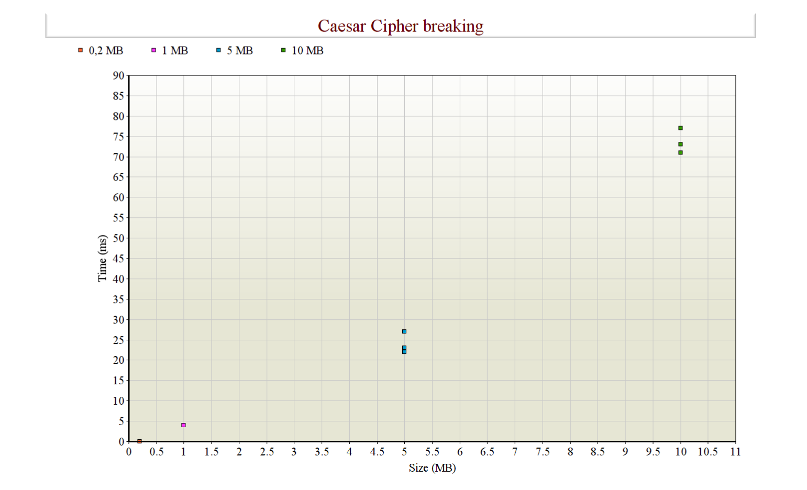
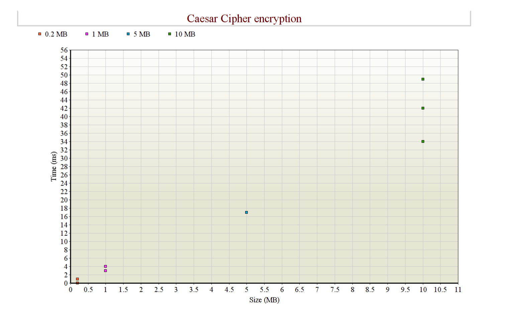
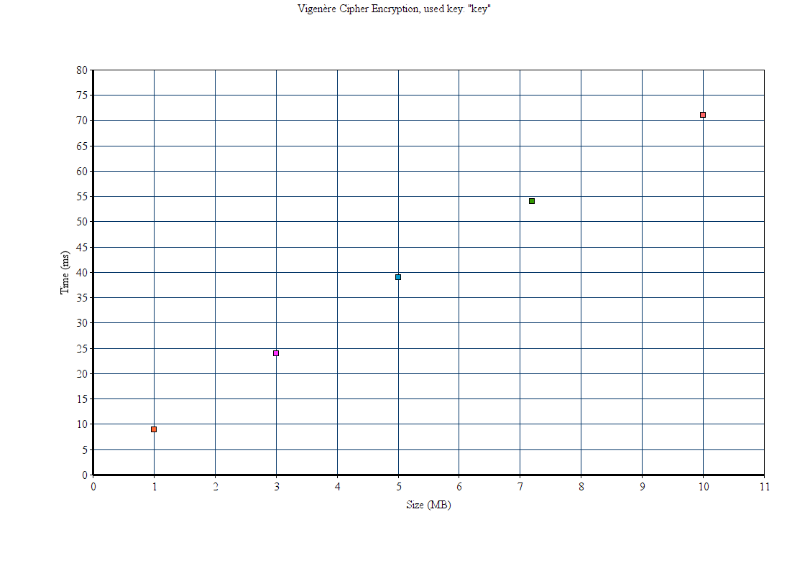
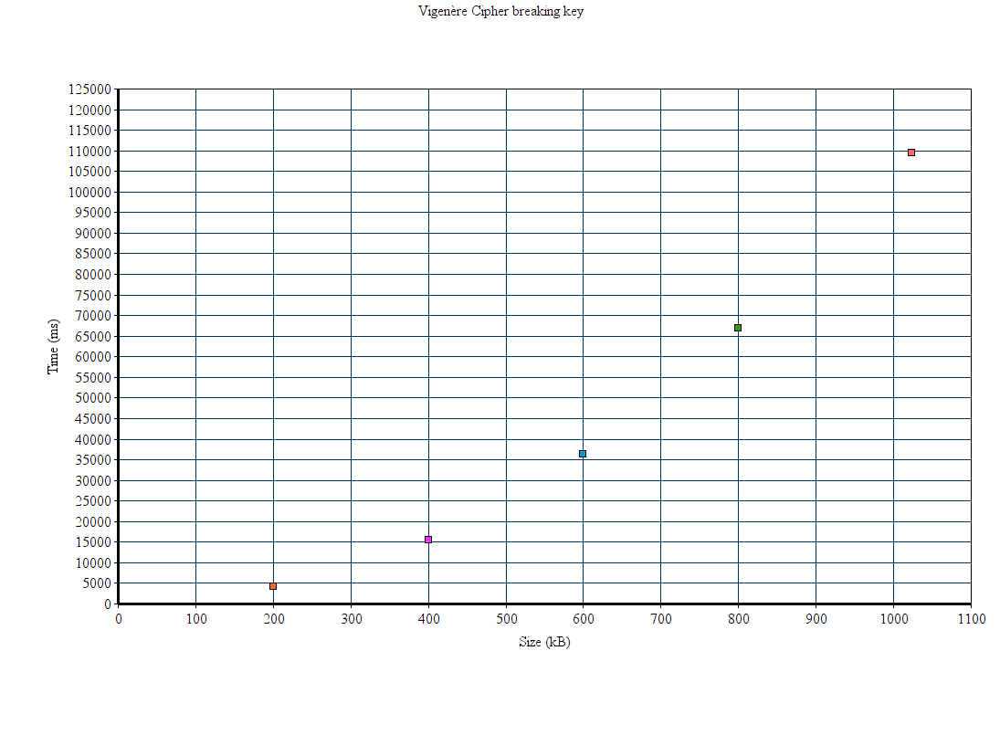
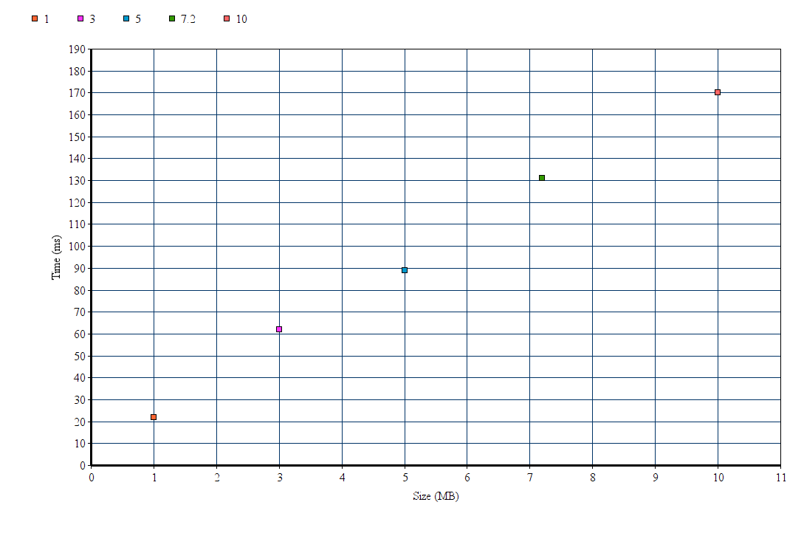
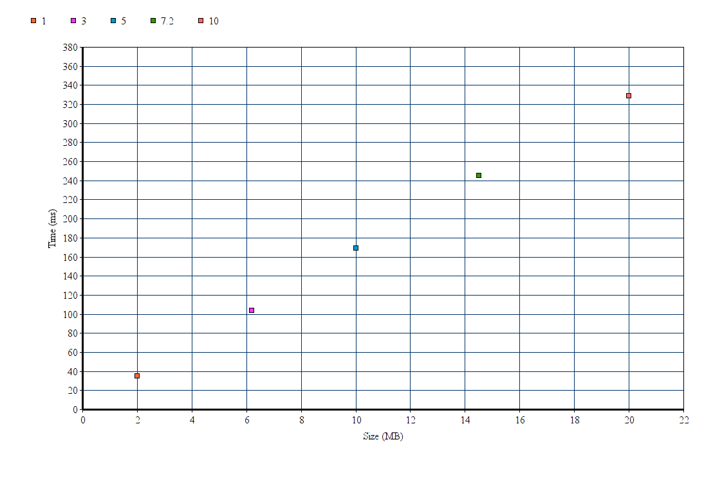

# Testausdokumentti

### Yksikkötestaus

Testeissä on testattu, että salaukset toimivat oikein ja myös purkavat salauksen oikein takaisin. Testit on tehty käyttäen JUnitia. Testien oikeat salaustulokset on tarkistettu myös osin käsin sekä valmiilla salausohjelmilla. 

Testit voidaan suorittaa komennolla

    mvn test

Jacoco voidaan suorittaa komennolla

    mvn jacoco:report

Raportti löytyy target/site/jacoco/index.html

### Suorituskykytestaus

Suorituskykytesteissä testataan Blowfish salauksen nopeutta salatessa ja salausta purkaessa eri kokoisilla tekstitiedostoilla. Vigenere ja Caesar salauksissa nopeutta testataan tapauksissa, joissa salaus yritetään murtaa tietämättä avainta. 

Blowfish salauksessa tutkitaan salaukseen sekä sen purkamiseen menevää aikaa erikokoisilla tekstitiedostoilla. 

Käytetty Java versio oli 1.8.0_211 ja käyttöjärjestelmä Ubuntu 18.04. 

### Miten testit voidaan toistaa?

Ohjelman alkunäkymässä on 3 eri nappia (file Caesar, file Vigenere ja file Blowfish), joista pääsee omiin näkymiinsä. Näihin voidaan syöttää salattava tai murrettava tekstitiedosto ja ohjelma laskee salaukseen tai murtamiseen kuluvan ajan. Ikkunassa näkyy tiedoston koko ja nopeus. 

### Testauksen tuloksia ja suorituskyky

Salauksien nopeuksia sekä murtoyrityksien nopeuksia tutkitaan Javan System.currenttimeMillis() -metodin avulla. 

#### Caesar Cipher

Toteutettua Caesar salausta testattiin erikokoisilla tekstitiedostoilla, joissa teksti oli kerätty yleisestä englanninkielen artikkelista tiedostoon ja muodostettu näin erikokoisia tekstitiedostoja.

Caesar Cipher testattiin tekstitiedostoilla, joiden koko oli 0.2 MB, 1 MB, 5 MB sekä 10 MB. Toistoja tehtiin useita, ja mitä pienempi tiedosto oli, sitä useammin salaus ja murto tapahtui samassa ajassa. Pienempiä tiedostoja testattiin myös, mutta koska aika oli niin nopea, ei niiden tulosten lisääminen kaavioon ole mielekästä. Kaaviosta nähdään, että salaus tapahtuu lineaarisessa ajassa. 

Ohjelmassa testattiin myös Caesar Cipher murron nopeutta tietämättä salausavaimen numeroa. Murto tapahtui lineaarisessa ajassa, kuten odotettua, sillä ohjelma käy tekstin kerran läpi ja laskee kuinka useasti kukin kirjain esiintyy. Tämän jälkeen aakkostaulukko, käydään kerran läpi, joka tapahtuu vakioajassa.  Murto oli hieman hitaampaa kuin salaus, mutta myös niin nopea, ettei pienillä tiedostoilla ollut mielekästä sitä testata enempää. 10 MB tekstitiedoston onnistui murtaa keskimäärin 75 millisekunnissa eli 0.075 sekunnissa.   

   
#### Vigenère Cipher

Vigenère Cipher salaus testattiin tekstitiedostoilla, kooltaan 1, 3, 5, 7.2 ja 10 MB.

Kaaviossa on kunkin tiedostokoon keskirvo mittauksista. Salaus toteutettiin salausavaimilla "blowfish" sekä "key" eli avainpituuksilla 8 ja 3. Avaimen pituudella ei todettu olevan vaikutusta salausaikoihin testatuilla tiedostokoilla. Salaus toimii lineaarisessa ajassa ja aika mitattiin itse salauksesta. Aikaan ei mitattu esimerkiksi salatun tekstin tiedostoon kirjoittamista.  

 

Vigenèrellä salatun tekstin murtamiseen kulunutta aikaa mitattiin tidostoilla, joiden koot olivat 200 kB, 400 kB, 600 kB, 800 kB ja 1 MB. Tässä mittauksessa ei ollut merkitystä, löytääkö murtoyritys oikean avaimenpituuden ja oikean avaimen, kunhan löytyi ehdotus avaimen pituudeksi sekä avaimeksi. Avaimen pituus oli 3 näissä tiedostoissa. Kun syötteen koko noin kaksinkertaistuu, salaukseen kulunut aika suurin piirtein nelinkertaistuu. Salauksen purussa käydään koko syöte samalla muodostaen 3 merkin yhdistelmiä. Nämä yhdistelmät käydään vielä läpi ja niistä etsitään samojen yhdistelmien erot ja lopulta lasketaan, mitä tekijää on eniten. Tämä on todennäköisin avaimen pituus. Avaimen arvauksessa syöte käydään vielä uudelleen kertaalleen läpi.  

 

#### Blowfish 

Blowfish salattiin ja avattiin tekstitiedostoilla, joiden koot olivat 1 MB, 3 MB, 5 MB, 7,2 MBn sekä 10 MB. Salaukset toteutettiin 64-, 128- ja 448-bittisillä avaimilla. 

Salaus 64 bittisellä avaimella:

Salauksen purku 64 bittisellä avaimella:

 
