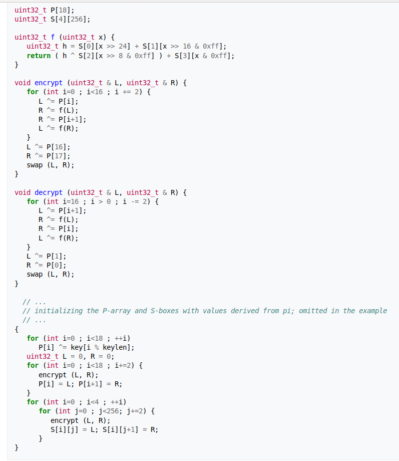

# Toteutusdokumentti

Ohjelma toteuttaa kolme eri salausargoritmia: Caesar Cipher, Vigenere Cipher ja lohkosalausalgoritmin Blowfish. Caasar Cipher ja Vigenere Cipher ovat yksinkertaisempia salausmenetelmiä ja ohjelma toteuttaa myös niiden murtamisyritykset, silloin kun salausavain ei ole tiedossa. 

JavaDoc generoidaan komennolla

    mvn javadoc:javadoc

Javadocia voi tarkastella avaamalla selaimella tiedosto sijainnista target/site/apidocs/index.html

[Generoitu JavaDoc](file:///home/milla/tiralabra/EncryptionAndCryptanalysis/EncryptionCryptAnalysis/target/site/apidocs/index.html)

### Ohjelman yleisrakenne

Ohjelma koostuu seuraavista pakkauksista:

#### cryptanalysis.ui

Sisältää graafisen käyttöliittymän ja on myös ohjelman pääluokka, joka käynnistää ohjelman. Frekvenssianalyysin kaavion piirtäminen toteutetaan myös tässä luokassa. 

##### cryptanalysis.blowfish

Sisältää luokan Blowfish, joka toteuttaa Blowfish salauksen ja purkamisen. Pakkauksessa sijaitseva Boxes luokka sisältää S-boxit ja P-boxit, joita käytetään alustuksessa ja salauksessa. 

#### cryptanalysis.ciphers

Sisältää luokan Caesar Cipher ja Vigenere Cipher, jotka toteuttavat kyseiset salaukset ja niiden purkamisen.

#### cryptanalysis.breaking

Sisältää luokat BreakingCaesarCipher.java, BreakingVigenereCipher.java,
#### cryptanalusis.dataStructures

Sisältää kaikkien omien tietorakenteiden toteutukset. Sisältää luokat MyArrayList, MyHashMap ... ..

#### cryptanalysis.cipherTest

Testiluokka, joka testaa Blowfish salausta, Caesar salausta ja Vigenere salausta.

#### cryptanalysis.datastructuresTest

Sisältää luokan DatastructureTest.java joka testaa omien tietorakenteiden oikein toimivuutta.  

### Salaus

#### Caesar Cipher

Caesar salakirjoitus on yksinkertainen salausmenetelmä, jossa jokainen salattava kirjain korvataan aakkosissa aina sovitun siirtomäärän jälkeen tulevalla kirjaimella. Aakkoston päättyessä siirto jatkuu aakkosten alusta. Caesar Cipher voidaan murtaa esimerkiksi käyttäen hyväksi frekvenssianalyysiä. 

#### Vigenere Cipher

Vigenere salaus on moniaakkosellinen salaus ja se käyttää useampaa salaus-aakkosta tiedon salaamiseen. Avainsana määrittää, mitä kirjaimia siirretään eteenpäin minkäkin verran. Avainsanan kirjaimet muutetaan siirtonumeroksi, jonka jälkeen tektiä käydään läpi muuttaen sitä eri siirroilla. Murtoa ei voida toteuttaa pelkällä kirjainten frekvenssianalyysillä. Esimerkiksi Kasiskin menetelmällä voidaan selvittää avainsanan pituus ja muodostaa erikseen frekvenssianalyysin avulla arvaus avaimesta. 

#### Blowfish

Blowfish on vuonna 1993 kehitetty erittäin vahva salausargoritmi. Blowfish on lohkosalaus ja data salataan 64 bitin eli 8 tavun lohkoissa tehden 16 kierrosta. Salausavaimen pituus voi olla 32-448 bittiä. Blowfishiä pidetään edelleen turvallisena salauksena ja se on myös erittäin nopea salausalgoritmi esimerkiksi verrattuna DES:iin.

Blowfishin pseudokoodi:

### Saavutetut aikavaativuudet

Kaikki 3 salausta toimivat lineaarisessa ajassa O(n) sekä salatessa, että purkaessa salausta. Salauksissa syöte käydään kerran läpi salaten teksti. Caesar Cipher käy läpi salattavan syötteen ja salaa sen samalla salausavaimella (numerolla). Vigenere Cipher muodostaa annetusta avaimesta ensin tekstin mittaisen avaimen ja käy sen jälkeen salattavan tekstin läpi muodostaen joka avaimen kirjaimen kohdalle sen vaatiman määrän siirtoa merkille. Blowfish salaus salaa syötteen 64 bitin lohkoissa tehden joka salausta 16 kierrosta. Salauksen avaus on Blowfishissa sama toiminto vastakkaiseen suuntaan. 

Murrot
erot avaimissa
java? 

### Lähteet

[Kasiski](https://crypto.interactive-maths.com/kasiski-analysis-breaking-the-co$
[Kas](https://pages.mtu.edu/~shene/NSF-4/Tutorial/VIG/Vig-Kasiski.html)

