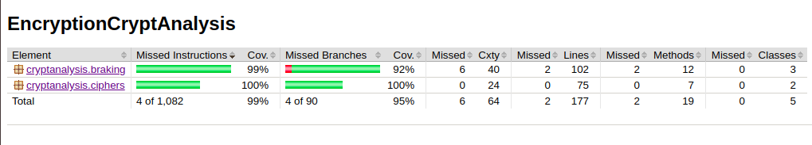

### Mitä olen tehnyt tällä viikolla?

Tein frekvenssianalyysiä ja vigenere salausta. Vigenere toteuttaa nyt salauksen sekä salauksen purkamisen salausavaimen avulla. Salausavaimen tulee olla normiaakkoston sana ja se muutetaan yhtä pitkäksi kuin salattava teksti ja sen jälkeen teksti muokataan sen mukaan. Tämä varmaan voisi olla fiksumpaa toteuttaa niin, että avainta ei muokattaisi vaan salaus osaisi aina hakea oikean kirjaimen heti oikeasta kohtaa. Toteutin myös käyttöliittymän ulkoasua ja loin erilliset näkymät eri salauksille. Frekvenssianalyysin tehty osio on vielä ainakin samassa caesar salauksen kanssa, sillä se toki liittyy vahvasti sen murtamiseen. Aloin toteuttaa myös vigeneren salauksen murtamista Kasiskin metodilla. Toteutin avaimen pituuden hakemisen ja nyt ohjelma ehdottaa todennäköisintä avainsanan pituutta (joka ei toki välttämättä ole se oikea). Lisäksi tein testejä ohjelmaan sekä vigenere salauksesta, että caesar salauksesta. 

### Miten ohjelma on edistynyt?

Salauksia on toteutettu lisää sekä tehty frekvenssianalyysiä. Vigenere encryptauksen ja decryptauksen lisäksi on toteutettu kasiskin menetelmää avaimen pituuden selvittämiseksi. Aluksi ohjelmassa on nyt vain näkymä, josta voi valita kumpaa salausta tutkii. Napit johtavat eri salauksien ikkunoihin. Ceasar salauksessa on mahdollista salata ja purkaa teksti sekä päästä näkymään, jossa näkyy salatun tekstin aakkosten frekvenssit. Lisäksi Ikkunassa on mahdollista tietämäyttä salausavainta, etsiä oikea salausavaimen numero (nappi find key). Options nappi näyttää kaikki tekstivaihtoehdot 26 eri avaimella. Vigenere ikkunassa on mahdollista salata ja purkaa teksti. Lisäksi Find key length -napista voi löytää parhaan ehdotuksen avaimen pituudelle, jolla teksti on salattu. Tämä toimii nyt parhaiten tekstillä, jossa ei ole välilyöntejä. Lisäksi tekstin pitää olla riittävän pitkä, tosin näin on muutoinkin Kasiskin menetelmässä. 

Ohjelmassa on aloitettu tekemään testejä ja testikattavuus on hyvä:

### Mitä opin tällä viikolla?

Opin Vigenere salauksen toiminnasta ja eri tavoista frekvenssianalyysin toteutustavoissa. Yksi paljon aikaa vienyt oli Kasiski examination ja siitä tuli luettua hyvin paljon. Vaikka nämä salausalgoritmit eivät ole monimutkaisimpia, toteutusta täytyi silti miettiä paljon ja etenkin vigeneren murtaminen ei olekaan aivan yksinkertaista.   

### Mikä jäi epäselväksi ja tuottanut vaikeuksia?

Kasiskin menetelmän tutkiminen ja toteuttaminen ja saaminen toimintaan vei paljon aikaa. Toistaiseksi on onnistuttu toteuttaa avaimen pituuden selvitys, joka näyttäisi toimivan ainakin tietyillä tarpeeksi pitkillä teksteillä. Toistaiseksi teksti täytyy olla muodostettu ilman välilyöntejä paremman toimivuuden takaamiseksi. En ole aivan varma kuinka paljon ja miten salauksia täytyy toteuttaa kurssin puitteissa. Lisäksi mietin, onko sallittua käyttää Javan Stringiä tässä.  

### Mitä teen seuraavaksi?

Jatkan Kasiskin metodin tutkimista ja toteutusta. Tarkoituksena olisi selvittää, miten avainsana saadaan Vigenere salatusta tekstistä selville sen jälkeen, kun avaimen (oletettu) pituus on tiedossa. Yritän tutkia Blowfish salausta ja myös alkaa selvittää jonkin oman tietorakenteen (lista tai HashMap) toteutusta. 
